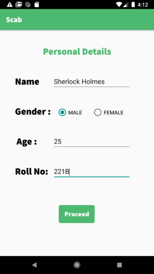
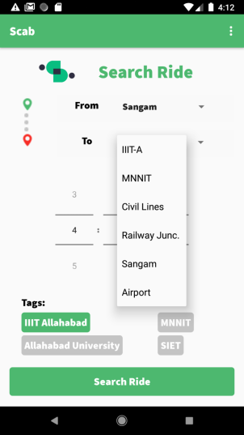
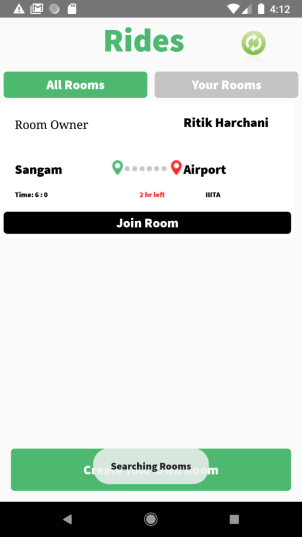
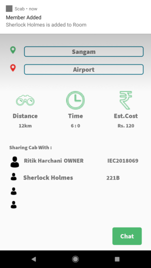

# Scab

## A Community Cab Sharing Service.

### The Idea:

Whenever we use a cab service, we need co-passengers to travel with us for reducing the per head travel cost.

For Example : When we try to share the ride, there is no proper platform available for it and social networking apps like whatsapp are used which are inappropriate and have limited reach.
Hence, our idea is to provide a service where separate ride sharing chat rooms are created by users for sharing rides with desired co-passengers at an efficient cost.

### Key Feature of the app includes: 

- Ride Fare Reduction
- Compatibility with co-passengers
- Last-Minute Ride Sharing
- Community Development
- Reduce Traffic Congestion
- Real time passenger availability status 
- Fare Estimation of Different Cab Companies if they provide their API service.

Here are some screenshots of android app made in Java.

----------------------------
### Authors
- [Ritik Harchani](https://github.com/harchani-ritik)
- [Kartik Nema](https://github.com/Kartik2301)
- [Vivek Kumar Mehta](https://github.com/arcane-tyro)
- [Priyesh Raj](https://github.com/ekthapriyesh24)

Designs of the mobile app made by [Achint Agarwal](https://github.com/achintagrawal) can be can be found at:

[Scab Designs](https://www.figma.com/file/iqpHdZb4S2JqNGa7znAICn/s-cab)
